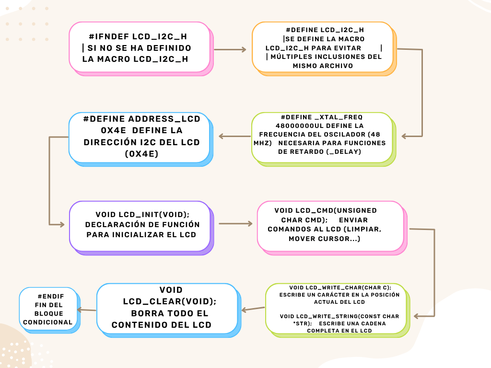
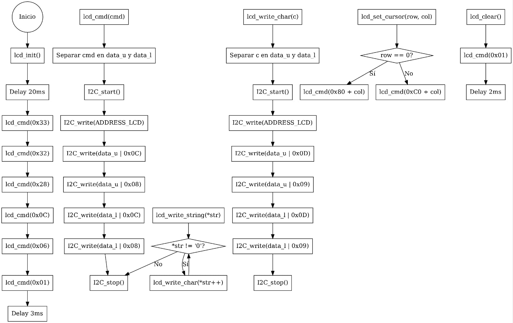
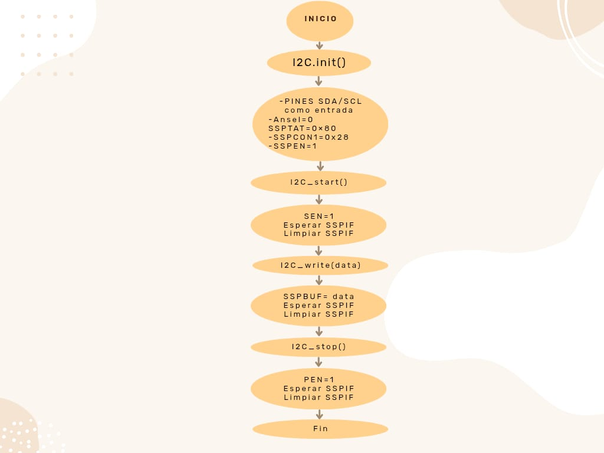
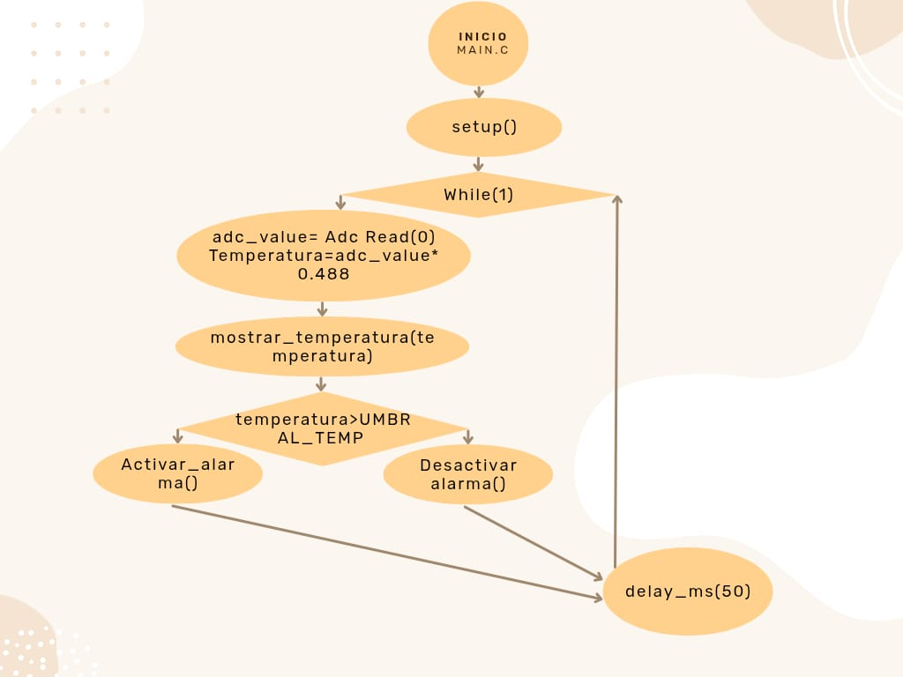

# Proyecto final

## Integrantes

[Juan Esteban Monroy Moya - 136851](https://github.com/Juanes20feb)

[Shirley Katherin Bohorquez Gil - 131164](https://github.com/Shirleyb0440)

[Alison Daniela Vera Rocha - 131212](https://github.com/Alisondaniela-bot)

## Nombre del proyecto: 

Sistema de prevención y alarma contra incendios. 

## Documentación

### Introducción

Este proyecto presenta el diseño e implementación de un sistema de monitoreo de temperatura basado en el microcontrolador PIC18F45K22. Se emplea un sensor analógico LM35, una pantalla LCD 16x2, un buzzer y un LED como alerta sonora y visual. El objetivo es activar una alarma cuando la temperatura supere los 40 °C. El sistema se desarrolló inicialmente en Proteus para pruebas de simulación y posteriormente fue implementado en una protoboard. Aunque no ofrece medición en tiempo real de alta precisión, cumple una función educativa y prototípica.

## Objetivo general

Diseñar e implementar un sistema de advertencia de temperatura de bajo costo, basado en un microcontrolador PIC18F45K22 y un sensor LM35, que permita visualizar el valor de temperatura en una pantalla LCD y activar una alarma y un led cuando se supere un umbral definido (40 °C).

## Objetivos especificos

-Desarrollar la simulación del circuito en Proteus, integrando el sensor LM35, el microcontrolador PIC18F45K22, una pantalla LCD 16x2, un buzzer y un LED.

-Programar el microcontrolador para adquirir la señal analógica del LM35 mediante el módulo ADC, convertirla a temperatura en grados Celsius y mostrarla en la pantalla LCD.

-Establecer una lógica de control que active el buzzer y el LED cuando la temperatura supere los 40 °C.

-Implementar físicamente el circuito en protoboard para verificar su funcionamiento práctico y compararlo con la simulación.

## Metodología

### Componentes utilizados

Sensor de temperatura LM35: Dispositivo analógico que proporciona una salida lineal proporcional a la temperatura ambiente. Su sensibilidad es de 10 mV por grado Celsius.

Microcontrolador PIC18F45K22: Unidad de control principal del sistema. Se encarga de adquirir la señal analógica del sensor mediante su conversor analógico-digital (ADC), procesarla y tomar decisiones lógicas de salida.

Pantalla LCD 16x2: Módulo de visualización donde se muestra el valor de temperatura en grados Celsius.

Buzzer (zumbador piezoeléctrico) y LED rojo: Actúan como indicadores de alerta. Se activan simultáneamente cuando la temperatura medida supera el umbral de 40 °C.

### Diseño y montaje del sistema

El proceso de desarrollo del sistema se dividió en dos fases:

## Simulación

Se realizó inicialmente un diseño del circuito en el entorno de simulación Proteus, permitiendo validar la lógica del sistema sin necesidad de hardware físico. El primer montaje se uso el sensor DS18820 y se conectó a una de las entradas analógicas del PIC18F45K22. La señal analógica fue digitalizada utilizando el módulo ADC del microcontrolador y convertida internamente a grados Celsius. El valor resultante se mostró en la pantalla LCD, y si superaba los 40 °C, el microcontrolador activaba una salida digital para encender el buzzer y el LED. Pero finalmente, para la implementacion final, se opto usar el sensor LM35, ya que se uso en otros proyectos finales de otras materias y se comprendio su funcionamiento al detalle.

## Implementación física

Tras validar el sistema en simulación, se construyó el circuito en una protoboard. El PIC18F45K22 se ubicó en el centro, conectado a los demás componentes con jumpers. El sensor LM35, posicionado para medir la temperatura ambiente, se enlazó al ADC del microcontrolador.

Una LCD 16x2 externa muestra la temperatura en °C, con un potenciómetro para ajustar el contraste. Un buzzer y un LED rojo, conectados a una salida digital, se activan si la temperatura supera los 40 °C.

## Resultados

Durante las pruebas en simulación y en protoboard, se verificó que el sistema puede mostrar correctamente temperaturas aproximadas. Por ejemplo, en una prueba de temperatura ambiente, se mostró un valor de 24.4 °C. Cuando se aumentó la temperatura (simulada), el buzzer y el LED se activaron como respuesta. Aunque no se trata de un sistema de precisión profesional, demuestra el funcionamiento esperado.

* Si deseas ver su funcionamiento [Haz clic aqui](Proyecto_final_Microprocesadores.mp4)

#### Visualización del código 

* Si deseas visualizar el código del programa principal [Haz clic aquí](main.c)

* Si deseas visualizar el código que contiene las funciones necesarias para configurar y operar el i2c [Haz clic aquí](i2c.c)

* Si deseas visualizar el código que contiene las funciones necesarias para configurar y operar el i2c en la LCD [Haz clic aquí](i2c_lcd.c)

* Si deseas visualizar el código que contiene las funciones necesarias para configurar y operar el ADC [Haz clic aquí](adc.c)

* Si deseas visualizar el código que contiene el encabezado con los prototipos de las funciones del i2c [Haz clic aquí](i2c.h)

* Si deseas visualizar el código que contiene el encabezado con los prototipos de las funciones de la LCD [Haz clic aquí](i2c_lcd.h)

* Si deseas visualizar el código que contiene el encabezado con los prototipos de las funciones del ADC [Haz clic aquí](adc.h)

* Si deseas visualizar el código que contiene el encabezado con los prototipos de las funciones del buzzer y LED [Haz clic aquí](LED_BUZZER.h)

## Explicación del codigo principal

### Encabezados y Configuraciones

`#include <xc.h>` : Incluye el archivo de cabecera principal del compilador XC8 para microcontroladores PIC, que contiene todas las definiciones específicas del hardware.  

`#include "adc.h"`: Incluye el archivo de cabecera personalizado para el manejo del Conversor Analógico-Digital (ADC).  

`#include "i2c.h"`: Incluye el archivo de cabecera para la comunicación I2C (Inter-Integrated Circuit).  

`#include "i2c_lcd.h"`: Incluye el archivo de cabecera para controlar una pantalla LCD a través de I2C.  

`#include "led_buzzer.h"`: Incluye definiciones para controlar un LED y un buzzer (probablemente contiene macros para los pines).  

`#pragma config FOSC = INTIO67`: Configura el oscilador para usar el oscilador interno, con los pines RA6 y RA7 disponibles como E/S digitales.  

`#pragma config WDTEN = OFF`: Desactiva el Watchdog Timer (perro guardián) para que no reinicie el programa.  

`#pragma config LVP = OFF`: Desactiva la programación de bajo voltaje (Low Voltage Programming).  

`#define _XTAL_FREQ 16000000`: Define la frecuencia del reloj como 16 MHz, necesaria para funciones de delay.  

`#define UMBRAL_TEMP 40.0f`: Define el umbral de temperatura en 40.0 grados Celsius (como float).  

## Definición de Animaciones

`const unsigned char animacion_custom[4][8] = { ... }`: Define una matriz 4x8 con patrones de bits para 4 frames de animación de "temperatura alta".  

`const unsigned char animacion_estable[4][8] = { ... }`: Define otra matriz 4x8 con patrones para animación de "temperatura estable".  

`unsigned char anim_index = 0 `: Variable para llevar el índice del frame de animación actual (0-3).  

## Función setup()

 `void setup(void) {`: Declara la función de configuración inicial.  

 `ADC_Init();`: Inicializa el módulo ADC (configura registros como ADCON0, ADCON1, etc.).  

 `I2C_init();`: Inicializa el módulo I2C (configura registros SSPCON, SSPSTAT, etc.).  

 `lcd_init();`: Inicializa la pantalla LCD (envía comandos de inicialización).  

`TRIS_DANGER_LED = 0;`: Configura el pin del LED de peligro como salida (TRISx register).  

`TRIS_BUZZER = 0;`: Configura el pin del buzzer como salida.  

`DANGER_LED = 0;`: Apaga el LED inicialmente (PORTx register).  

 `BUZZER = 0;}`: Apaga el buzzer inicialmente. 

## Función lcd_write_number()

`void lcd_write_number(unsigned int number) {`  
`char d1 = (number / 100) % 10;`  
`char d2 = (number / 10) % 10;`  
`char d3 = number % 10;`  
`if (d1 > 0) lcd_write_char(d1 + '0');`  
`else lcd_write_char(' ');`  
`lcd_write_char(d2 + '0');`  
`lcd_write_char('.');`  
`lcd_write_char(d3 + '0');`  
`lcd_write_char(' ');`  
`lcd_write_char('C');}`  

La función `lcd_write_number(unsigned int number)` muestra un número formateado como temperatura en el LCD: primero extrae el dígito de las centenas (d1), decenas (d2) y unidades (d3) dividiendo y usando el operador módulo para aislar cada dígito. Si el dígito de las centenas es mayor que 0, lo muestra convertido en carácter ASCII sumándole '0'; si no hay centenas, muestra un espacio para mantener el formato. Luego muestra el dígito de las decenas y el punto decimal, seguido por el dígito de las unidades, también convertido a carácter. Por último, muestra un espacio y la letra 'C' para indicar grados Celsius.

## Función lcd_create_custom_char()

`void lcd_create_custom_char(unsigned char location, const unsigned char *pattern) {`  
`location &= 0x07;`  
`lcd_cmd(0x40 + (location * 8));`  
`for (unsigned char i = 0; i < 8; i++) {`  
`lcd_write_char(pattern[i]);}}`  

La función `lcd_create_custom_char(unsigned char location, const unsigned char *pattern)` define un carácter personalizado para el LCD: primero restringe la ubicación a un rango válido (0-7) usando una máscara binaria (location &= 0x07). Luego, envía un comando al LCD para ubicar el cursor en la memoria CGRAM donde se almacenan los caracteres personalizados, calculando la dirección con 0x40 + (location * 8). A continuación, recorre un bucle de 8 iteraciones y escribe cada byte del patrón (pattern[i]), que representa las filas de la matriz de puntos del carácter, construyendo así el nuevo carácter en el LCD.

## Función mostrar_temperatura()

`void mostrar_temperatura(float temp) {`  
`unsigned int temp_entera = (unsigned int)(temp * 10);`  
`lcd_set_cursor(0, 0);`  
`lcd_write_string("Temp ");`  
`lcd_write_number(temp_entera);`
`lcd_write_string("   ");`
`lcd_set_cursor(1, 0);`  
`if (temp > UMBRAL_TEMP) {`  
`lcd_write_string("Temp excesiva ");`  
`lcd_create_custom_char(0, animacion_custom[anim_index]);`  
`lcd_set_cursor(1, 15);` 
`lcd_write_char(0)};`  
`else {`
`lcd_write_string("Temp estable   ");`  
`lcd_create_custom_char(0, animacion_estable[anim_index]);`  
`lcd_set_cursor(1, 15);`  
`lcd_write_char(0);}`  
`anim_index = (anim_index + 1) % 4;}`  

La función `mostrar_temperatura(float temp)` muestra la temperatura en el LCD: primero convierte la lectura flotante a un valor entero multiplicando por 10 (ejemplo: 25.6 → 256) para facilitar su visualización. Luego posiciona el cursor en la primera fila y columna con lcd_set_cursor(0,0) y escribe "Temp ", seguido del valor de temperatura y algunos espacios para limpiar caracteres previos. Después posiciona el cursor en la segunda fila y verifica si la temperatura supera el umbral `(UMBRAL_TEMP)`. Si la temperatura es alta, muestra el mensaje "Temp excesiva", crea un carácter personalizado de alerta usando el frame actual de la animación `(animacion_custom[anim_index])`, y lo dibuja en la última columna de la segunda fila. Si la temperatura es normal, muestra "Temp estable", carga un carácter de animación estable, y lo dibuja igualmente. Finalmente, incrementa el índice de animación (anim_index) de forma cíclica (0 a 3) para lograr la animación.

## Funciones de Alarma

`void activar_alarma_pwm(void) {`   
`for (int i = 0; i < 10; i++) {`    
`DANGER_LED = 1;`  
`BUZZER = 1;`   
`__delay_ms(10);`    
`DANGER_LED = 0;`    
`BUZZER = 0;`    
`__delay_ms(10);}}`    
`void desactivar_alarma(void) {`  
`DANGER_LED = 0;`    
`BUZZER = 0;}`    

La función `activar_alarma_pwm()` enciende una alarma de efecto intermitente con PWM al ejecutar un bucle de 10 ciclos `(for (int i = 0; i < 10; i++))`, donde en cada ciclo enciende el LED `(DANGER_LED = 1)` y el buzzer `(BUZZER = 1)`, espera 10 ms, los apaga `(DANGER_LED = 0, BUZZER = 0)` y vuelve a esperar otros 10 ms, generando un parpadeo rápido. Por otro lado, la función desactivar_alarma() simplemente apaga ambos dispositivos de alarma (LED y buzzer) estableciendo ambos a 0.

## Función principal main()

`void main(void) {`   
`setup();`  
`while (1) {`   
`unsigned int adc_value = ADC_Read(0);`      
`float temperatura = adc_value * 0.488f;`    
`mostrar_temperatura(temperatura);`    
`if (temperatura > UMBRAL_TEMP) {`    
`activar_alarma_pwm();}`   
`else {`  
`desactivar_alarma();}`   
`__delay_ms(50)}};`  

El programa principal se define en la función void main(void) y comienza llamando a setup(), que configura los periféricos. Luego entra en un bucle infinito, donde primero lee el valor del ADC del canal 0 `(unsigned int adc_value = ADC_Read(0);)` y convierte esa lectura a temperatura en grados Celsius con la fórmula `float temperatura = adc_value * 0.488f;`, asumiendo el uso del sensor LM35 y la referencia de 5V. Después muestra la temperatura en el LCD con `mostrar_temperatura(temperatura);`. Se compara la temperatura leída con un umbral `(UMBRAL_TEMP);` si la temperatura excede el umbral, se activa una alarma usando PWM `(activar_alarma_pwm();)`, de lo contrario, se apaga la alarma `(desactivar_alarma();)`. Finalmente, se introduce un retardo de 50ms (__delay_ms(50);) para evitar lecturas demasiado rápidas.

## Diagramas

### i2c.h

### i2c_lcd.h

### i2c_lcd.c

### i2c.c

### main.c

## Conclusiones

Este código permite implementar un sistema para el monitoreo de temperatura en tiempo real. Su estructura simple y funcional facilita la detección de cambios de temperatura y la activación de mecanismos de alerta o protección. Puede utilizarse en laboratorios, espacios domésticos, entornos educativos u otras aplicaciones donde se requiera mantener condiciones térmicas controladas.   

## Referencias 

[1] [ECCI-Microprocesadores-2025-I](https://github.com/DianaNatali/ECCI-Microprocesadores-2025-I-)
