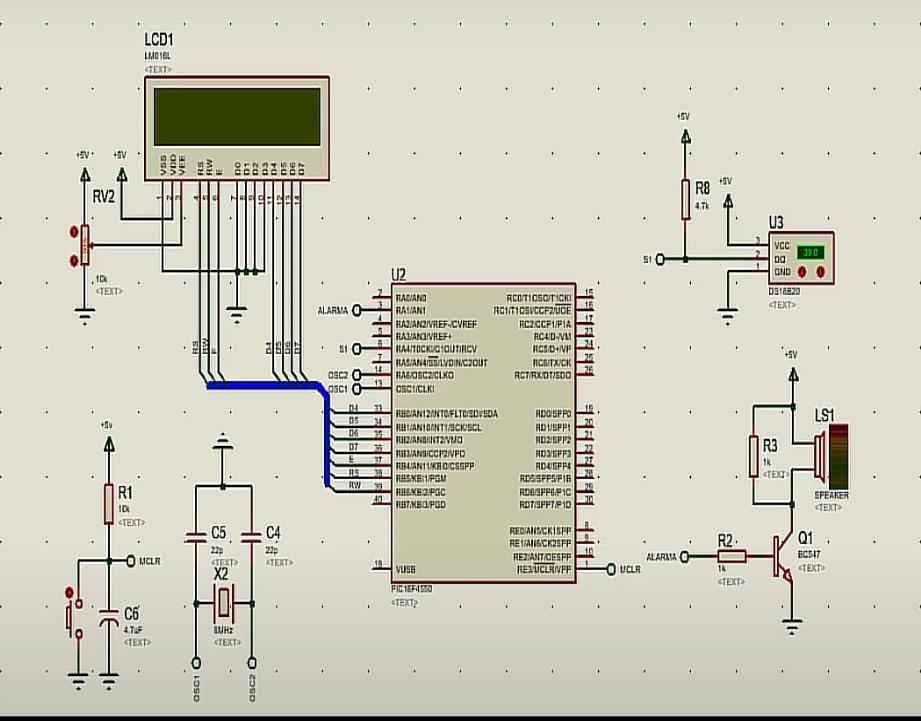
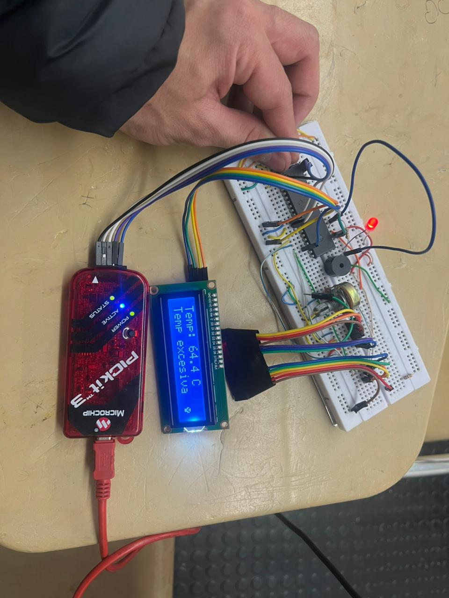

# Proyecto final

## Integrantes

[Juan Esteban Monroy Moya - 136851](https://github.com/Juanes20feb)

[Shirley Katherin Bohorquez Gil - 131164](https://github.com/Shirleyb0440)

[Alison Daniela Vera Rocha - 131212](https://github.com/Alisondaniela-bot)

## Nombre del proyecto: 

Sistema de prevención y alarma contra incendios. 

## Documentación

### Introducción

Este proyecto presenta el diseño e implementación de un sistema de monitoreo de temperatura basado en el microcontrolador PIC18F45K22. Se emplea un sensor analógico LM35, una pantalla LCD 16x2, un buzzer y un LED como alerta sonora y visual. El objetivo es activar una alarma cuando la temperatura supere los 40 °C. El sistema se desarrolló inicialmente en Proteus para pruebas de simulación y posteriormente fue implementado en una protoboard. Aunque no ofrece medición en tiempo real de alta precisión, cumple una función educativa y prototípica.

## Objetivo general

Diseñar e implementar un sistema de advertencia de temperatura de bajo costo, basado en un microcontrolador PIC18F45K22 y un sensor LM35, que permita visualizar el valor de temperatura en una pantalla LCD y activar una alarma y un led cuando se supere un umbral definido (40 °C).

## Objetivos especificos

-Desarrollar la simulación del circuito en Proteus, integrando el sensor LM35, el microcontrolador PIC18F45K22, una pantalla LCD 16x2, un buzzer y un LED.

-Programar el microcontrolador para adquirir la señal analógica del LM35 mediante el módulo ADC, convertirla a temperatura en grados Celsius y mostrarla en la pantalla LCD.

-Establecer una lógica de control que active el buzzer y el LED cuando la temperatura supere los 40 °C.

-Implementar físicamente el circuito en protoboard para verificar su funcionamiento práctico y compararlo con la simulación.

## Metodología

### Componentes utilizados

Sensor de temperatura LM35: Dispositivo analógico que proporciona una salida lineal proporcional a la temperatura ambiente. Su sensibilidad es de 10 mV por grado Celsius.

Microcontrolador PIC18F45K22: Unidad de control principal del sistema. Se encarga de adquirir la señal analógica del sensor mediante su conversor analógico-digital (ADC), procesarla y tomar decisiones lógicas de salida.

Pantalla LCD 16x2: Módulo de visualización donde se muestra el valor de temperatura en grados Celsius.

Buzzer (zumbador piezoeléctrico) y LED rojo: Actúan como indicadores de alerta. Se activan simultáneamente cuando la temperatura medida supera el umbral de 40 °C.

### Diseño y montaje del sistema

El proceso de desarrollo del sistema se dividió en dos fases:

## Simulación

Se realizó inicialmente un diseño del circuito en el entorno de simulación Proteus, permitiendo validar la lógica del sistema sin necesidad de hardware físico. El primer montaje se uso el sensor DS18820 y se conectó a una de las entradas analógicas del PIC18F45K22. La señal analógica fue digitalizada utilizando el módulo ADC del microcontrolador y convertida internamente a grados Celsius. El valor resultante se mostró en la pantalla LCD, y si superaba los 40 °C, el microcontrolador activaba una salida digital para encender el buzzer y el LED. Pero finalmente, para la implementacion final, se opto usar el sensor LM35, ya que se uso en otros proyectos finales de otras materias y se comprendio su funcionamiento al detalle.

## Implementación física

Tras validar el sistema en simulación, se construyó el circuito en una protoboard. El PIC18F45K22 se ubicó en el centro, conectado a los demás componentes con jumpers. El sensor LM35, posicionado para medir la temperatura ambiente, se enlazó al ADC del microcontrolador.

Una LCD 16x2 externa muestra la temperatura en °C, con un potenciómetro para ajustar el contraste. Un buzzer y un LED rojo, conectados a una salida digital, se activan si la temperatura supera los 40 °C.

## Resultados

Durante las pruebas en simulación y en protoboard, se verificó que el sistema puede mostrar correctamente temperaturas aproximadas. Por ejemplo, en una prueba de temperatura ambiente, se mostró un valor de 24.4 °C. Cuando se aumentó la temperatura (simulada), el buzzer y el LED se activaron como respuesta. Aunque no se trata de un sistema de precisión profesional, demuestra el funcionamiento esperado.

* Si deseas ver su funcionamiento [Haz clic aqui](Proyecto_final_Microcontroladores.mp4)

#### Visualización del código 

* Si deseas visualizar el código del programa principal [Haz clic aquí](main.c)

* Si deseas visualizar el código que contiene las funciones necesarias para configurar y operar el i2c [Haz clic aquí](i2c.c)

* Si deseas visualizar el código que contiene las funciones necesarias para configurar y operar el i2c en la LCD [Haz clic aquí](i2c_lcd.c)

* Si deseas visualizar el código que contiene las funciones necesarias para configurar y operar el ADC [Haz clic aquí](adc.c)

* Si deseas visualizar el código que contiene el encabezado con los prototipos de las funciones del i2c [Haz clic aquí](i2c.h)

* Si deseas visualizar el código que contiene el encabezado con los prototipos de las funciones de la LCD [Haz clic aquí](i2c_lcd.h)

* Si deseas visualizar el código que contiene el encabezado con los prototipos de las funciones del ADC [Haz clic aquí](adc.h)

## Diagramas

## Conclusiones

